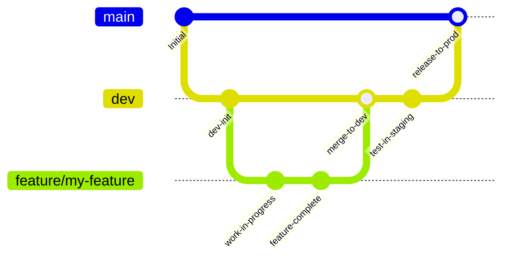

# Agent Guidelines & Engineering Workflow

This document sets the mandatory standards and operational rules for any AI agent or automated contributor working on the **Finance-tracker** repository.

---

## 1. Golden Rules of Git & Version Control

> [!IMPORTANT]
> **EVERY ACTION MUST BE COMMITTED AND IMMEDIATELY PUSHED TO THE REMOTE REPOSITORY.**
> Do not batch changes into mega-commits across multiple unrelated tasks. Once a task, bugfix, or distinct feature step is completed and verified, commit it and immediately run `git push`.

### 1.1. Mandatory Commit & Push Discipline
- **Atomic Commits**: Keep commits concise, focused, and self-contained with clear conventional commit messages (`feat:`, `fix:`, `refactor:`, `test:`, `docs:`, `chore:`).
- **Never Leave Unpushed Commits**: Every local commit must be followed by `git push origin <branch>`.
- **Pre-Push Verification**: Always verify before committing:
  1. Tests pass: `npm test` (`vitest run`).
  2. Typecheck passes: `npx tsc --noEmit`.
  3. No secrets or temporary session files (e.g. `cookies.txt`, `.env`) are staged.

---

## 2. Branching Strategy & Workflow

This project follows a structured Git branching model to ensure production stability while enabling safe testing.



### 2.1. Branch Types
1. **`main` (Production)**:
   - Contains strictly production-ready, verified code.
   - Deployments to production (servers / Proxmox / Docker) run off this branch.
   - Direct commits to `main` are restricted unless explicitly instructed by the repository owner.
2. **`dev` (Integration & Testing)**:
   - Central staging branch.
   - All feature and fix branches are merged into `dev` for integration testing and staging validation.
   - Once thoroughly tested on `dev`, changes are merged into `main`.
3. **Working Branches**:
   - `feature/<feature-name>`: New capabilities and user-facing additions.
   - `fix/<issue-name>`: Bug fixes and edge-case resolution.
   - `refactor/<scope>`: Code cleanup and architectural restructuring.
   - `test/<scope>`: Additional test suites and benchmarks.

### 2.2. Typical Development Lifecycle
1. Branch off `dev`:
   ```bash
   git checkout dev
   git pull origin dev
   git checkout -b feature/my-feature
   ```
2. Implement, verify with tests, commit, and push immediately:
   ```bash
   npm test
   npx tsc --noEmit
   git add .
   git commit -m "feat: implement feature xyz"
   git push -u origin feature/my-feature
   ```
3. Merge into `dev` for integration testing:
   ```bash
   git checkout dev
   git pull origin dev
   git merge feature/my-feature
   git push origin dev
   ```
4. Release from `dev` to `main`:
   ```bash
   git checkout main
   git pull origin main
   git merge dev
   git push origin main
   ```

---

## 3. Architecture & Code Conventions

### 3.1. Database Layer (PostgreSQL + SQLite Dual Adapter)
- **Primary Database**: PostgreSQL 16 (via `lib/pg.ts` and `lib/pg-repo.ts`).
- **Local / Test Database**: SQLite via `better-sqlite3`.
- **Data Adapter**: Any application route or service **must** access the database through `lib/data-adapter.ts`. Do not import `better-sqlite3` or `pg` directly into API routes.
- **BigInt Safety**: In PostgreSQL, all time stamps and minor currency values (kopecks) are `BIGINT`. The type parser is configured in `lib/pg.ts` to convert `BIGINT` to JavaScript `number`. Maintain this invariant.

### 3.2. Data Migrations
- Migration from SQLite to PostgreSQL is handled via `scripts/migrate-sqlite-to-pg.ts` (`npm run migrate:pg`).
- `scripts/pgloader.load` provides alternative schema and data loading via `pgloader`.

### 3.3. Monobank Integration
- Rate limiters must never be bypassed (`lib/sync/rateLimiter.ts`).
- Tokens are encrypted with AES-256-GCM before storage (`lib/crypto.ts`).
- Statement syncing uses chunked backward windows to respect API quotas.

---

## 4. Environment & Secrets Management
- Never commit `.env` or sensitive session tokens.
- Keep `.env.example` up to date whenever new configuration keys (e.g., PostgreSQL credentials) are added.
- In Docker, services communicate via service names (e.g., `db:5432`).
