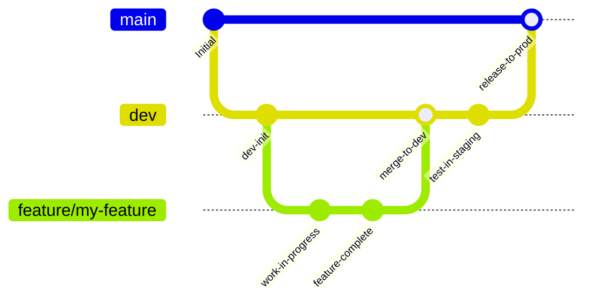

# Agent Guidelines & Engineering Workflow

This document sets the mandatory standards and operational rules for any AI agent or automated contributor working on the **Finance-tracker** repository.

---

## 1. Golden Rules of Git & Version Control

> [!IMPORTANT]
> **EVERY ACTION MUST BE COMMITTED AND IMMEDIATELY PUSHED TO THE REMOTE REPOSITORY.**
> Do not batch changes into mega-commits across multiple unrelated tasks. Once a task, bugfix, or distinct feature step is completed and verified, commit it and immediately run `git push`.

### 1.1. Mandatory Commit & Push Discipline
- **Atomic Commits**: Keep commits concise, focused, and self-contained with clear conventional commit messages (`feat:`, `fix:`, `refactor:`, `test:`, `docs:`, `chore:`).
- **Never Leave Unpushed Commits**: Every local commit must be followed by `git push origin <branch>`.
- **Pre-Push Verification**: Always verify before committing:
  1. Tests pass: `npm test` (`vitest run`).
  2. Typecheck passes: `npx tsc --noEmit`.
  3. No secrets or temporary session files (e.g. `cookies.txt`, `.env`) are staged.

---

## 2. Branching Strategy & Workflow

This project follows a structured Git branching model to ensure production stability while enabling safe testing.



### 2.1. Branch Types
1. **`main` (Production)**:
   - Contains strictly production-ready, verified code.
   - Deployments to production (Prod VM, port 3000) run automatically off this branch.
   - > [!CAUTION]
   - > **NEVER PUSH DIRECTLY TO `main`!** Direct commits and direct pushes to `main` are strictly forbidden. All updates to `main` must arrive exclusively through an approved GitHub Pull Request from `dev`.
2. **`dev` (Integration & Staging)**:
   - Central staging branch.
   - Deployments to staging (Dev VM, port 3001) run automatically off this branch.
   - All feature and fix branches are merged into `dev` via Pull Requests.
3. **Working Branches**:
   - `feature/<feature-name>`: New capabilities and user-facing additions.
   - `fix/<issue-name>`: Bug fixes and edge-case resolution.
   - `refactor/<scope>`: Code cleanup and architectural restructuring.
   - `test/<scope>`: Additional test suites and benchmarks.

### 2.2. Two-Stage Pull Request Workflow

```mermaid
flowchart LR
    A["feature/* branch"] -->|"1. gh pr create"| B["PR -> dev"]
    B -->|"Review & Merge"| C["dev branch"]
    C -->|"Auto-Deploy (port 3001)"| D["Staging Validation"]
    D -->|"2. gh pr create"| E["PR -> main"]
    E -->|"Review & Merge"| F["main branch"]
    F -->|"Auto-Deploy (port 3000)"| G["Production Active"]
```



1. **Feature/Fix Development**:
   - Branch off `dev`:
     ```bash
     git checkout dev
     git pull origin dev
     git checkout -b feature/my-feature
     ```
   - Implement, verify tests (`npm test`), verify types (`npx tsc --noEmit`), commit, and push:
     ```bash
     git add .
     git commit -m "feat: implement feature xyz"
     git push -u origin feature/my-feature
     ```

2. **Stage 1: Pull Request to `dev` (Review & Staging)**:
   - Create a Pull Request into `dev` using GitHub CLI:
     ```bash
     gh pr create --base dev --head feature/my-feature --title "feat: implement feature xyz" --body "Summary of changes"
     ```
   - Review and merge the PR on GitHub into `dev`.
   - GitHub Actions will automatically run the CI suite and trigger `deploy-dev` on the self-hosted Dev VM (port 3001).
   - Test and validate live functionality in the staging environment.

3. **Stage 2: Pull Request to `main` (Release to Production)**:
   - Once verified on the staging server, open a release PR from `dev` into `main`:
     ```bash
     gh pr create --base main --head dev --title "release: integrate feature xyz into production" --body "Changelog and verification results"
     ```
   - Review and merge the PR on GitHub into `main`.
   - GitHub Actions will automatically trigger `deploy-prod` on the self-hosted Prod VM (port 3000).

---

## 3. Architecture & Code Conventions

### 3.1. Database Layer (PostgreSQL + SQLite Dual Adapter)
- **Primary Database**: PostgreSQL 16 (via `lib/pg.ts` and `lib/pg-repo.ts`).
- **Local / Test Database**: SQLite via `better-sqlite3`.
- **Data Adapter**: Any application route or service **must** access the database through `lib/data-adapter.ts`. Do not import `better-sqlite3` or `pg` directly into API routes.
- **BigInt Safety**: In PostgreSQL, all time stamps and minor currency values (kopecks) are `BIGINT`. The type parser is configured in `lib/pg.ts` to convert `BIGINT` to JavaScript `number`. Maintain this invariant.

### 3.2. Data Migrations
- Migration from SQLite to PostgreSQL is handled via `scripts/migrate-sqlite-to-pg.ts` (`npm run migrate:pg`).
- `scripts/pgloader.load` provides alternative schema and data loading via `pgloader`.

### 3.3. Monobank Integration
- Rate limiters must never be bypassed (`lib/sync/rateLimiter.ts`).
- Tokens are encrypted with AES-256-GCM before storage (`lib/crypto.ts`).
- Statement syncing uses chunked backward windows to respect API quotas.

---

## 4. Environment & Secrets Management
- Never commit `.env` or sensitive session tokens.
- Keep `.env.example` up to date whenever new configuration keys (e.g., PostgreSQL credentials) are added.
- In Docker, services communicate via service names (e.g., `db:5432`).
